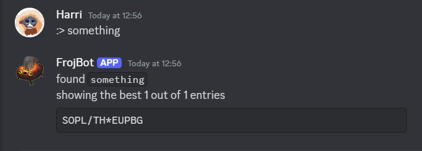
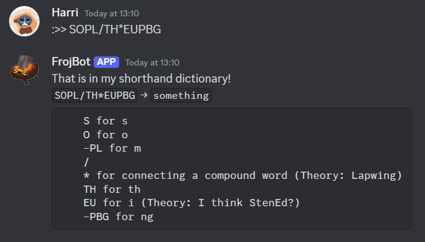

# Froj 
!!!incomplete
Creates a list of possible write-outs by combining your theory and a list of words, and their pronunciation/morphology

# Word lookup
## Unannotated

## Annotated

# Entry lookup

## Unannotated

##  Annotated
